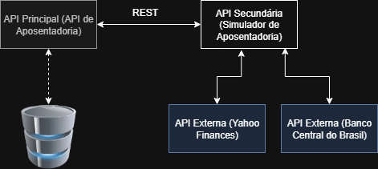

# Retirement Core

Retirement Core é um simulador de aposentadoria - API Principal para o MVP da PUC‑RIO, integrada com a API do Yahoo Finanças e do BCB.

## Como rodar o projeto
- Clone o repositório e o repositório secundário (Retirement-Simulator) na mesma pasta
- Entre na pasta raiz do Retirement-Core
- Rode docker compose up --build

## APIs Usadas
Banco Central do Brasil: utilizada rota SELIC
    - https://dadosabertos.bcb.gov.br/
Yahoo Finances: Dados da ^BVSP
    - https://query1.finance.yahoo.com/v8/finance/chart/%5EBVSP

